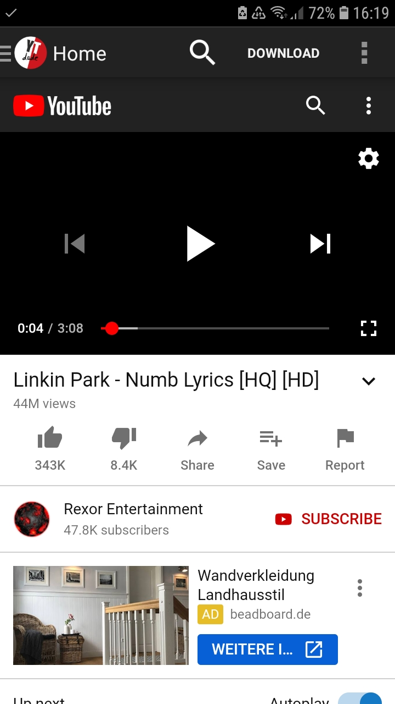
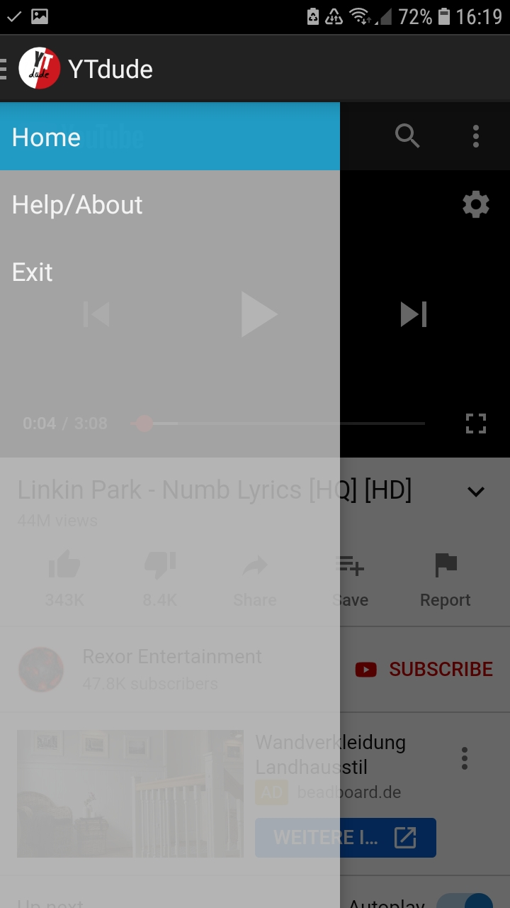
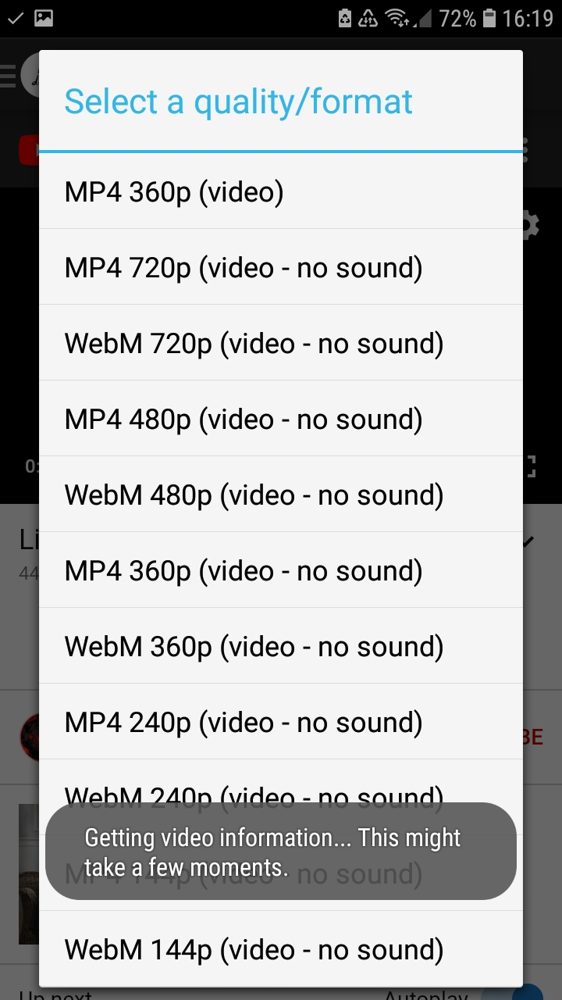
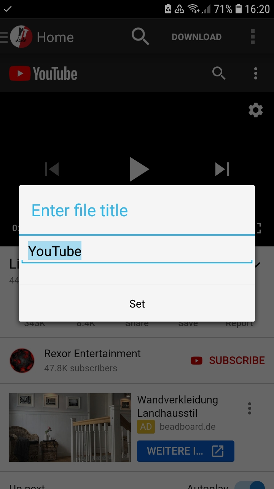
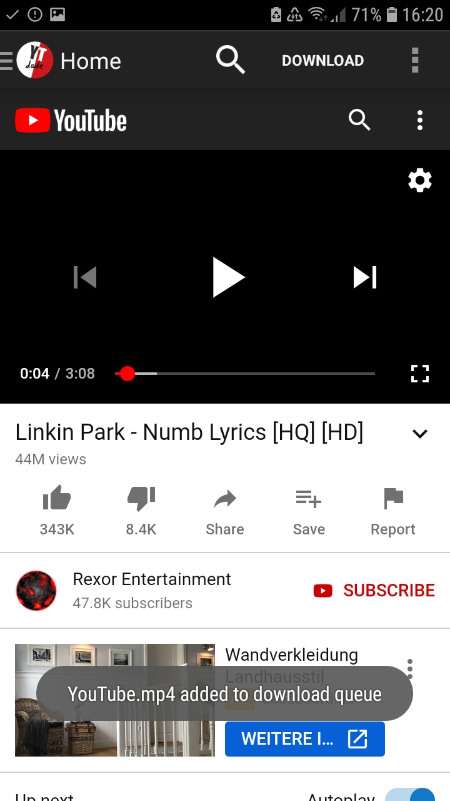

# About project
### Quality: **hacky**
### Year of creation: 2016

## Scale of quality
**professional**
maintainable, scalable and performing -> well thought out architecture, clean structure, complete documentation

**prototyping**
maintainable and scalable to a certain extent -> rough architecture, clean structure, readable

**OK**
maintainable -> clean structure, readable

**hacky**
just good enough to run

# YTdude
A Youtube-Downloader app for Android I've built with Java using the Android SDK. I did it to practice Java and Android SDK and out of curiosity about how easy it would be to get to YouTube ressources. It worked for around 6 month until YouTube patched the loophole.

## Legal
Since I've only used it for myself and it does not work anymore for years, I hope it's okay to have this on my GitHub.

